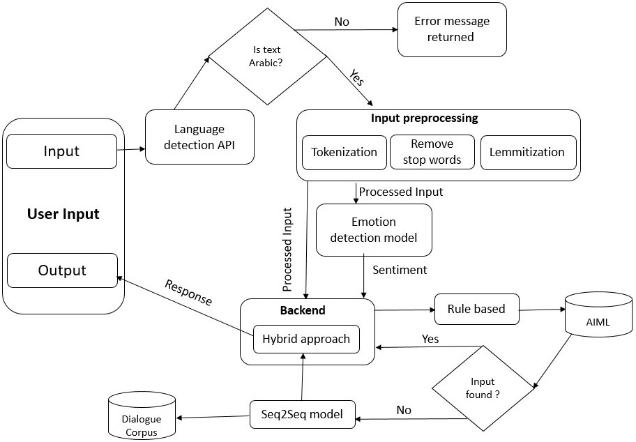

# Chatbot
Arabic based chatbot that simulates the working responsibilities of a psychiatrist 

# Project Description 
This chatbot is made as part of my thesis to explore the possibility of implementing an intelligentagent  in  Arabic  that
simulates  some  of  the  job  responsibilities  of  a  psychiatrist  andprovides  medical  advice  and  general  mental 
health  advice  for  patients. The  solution proposed by the research is to build a chatbot that advises patients and converse withthem. 
The chatbot should make patients feel less anxious and worried after the session.

# Chatbot Architecture 

The below image displays the chatbot architecture 

